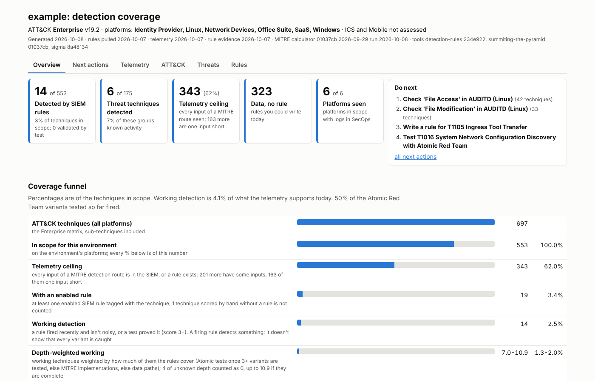
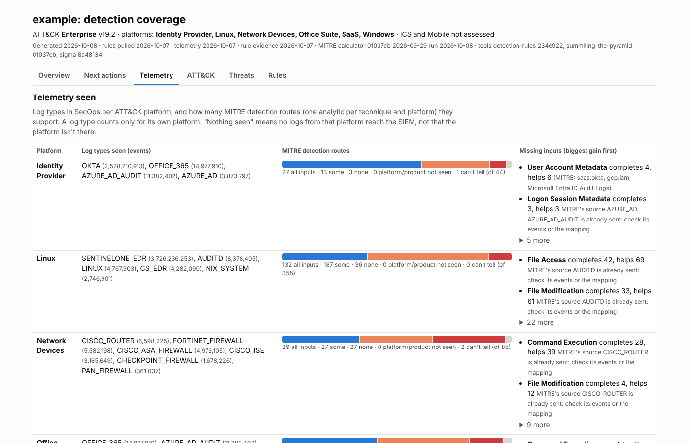
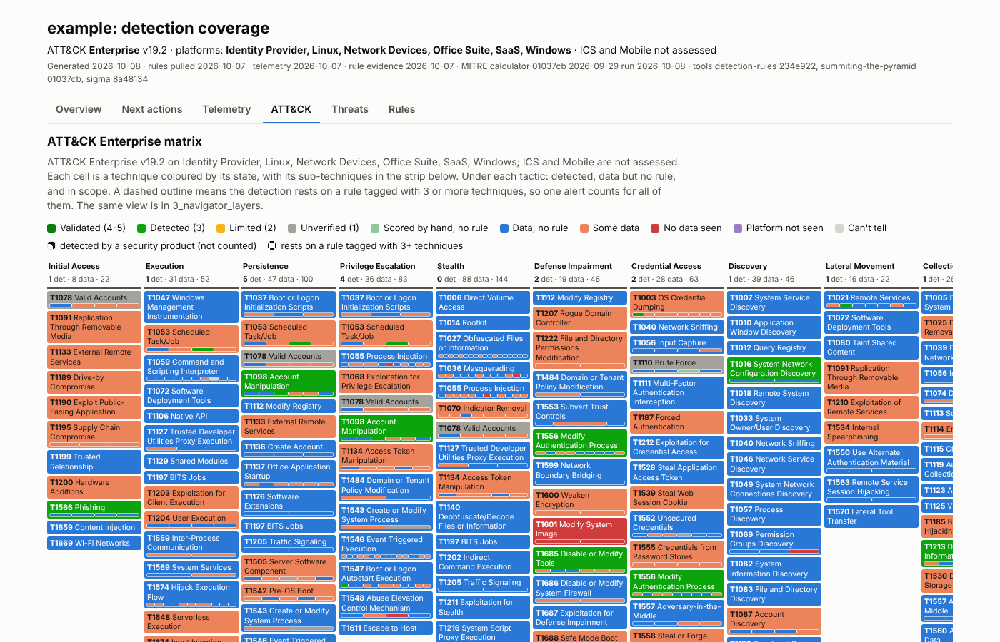
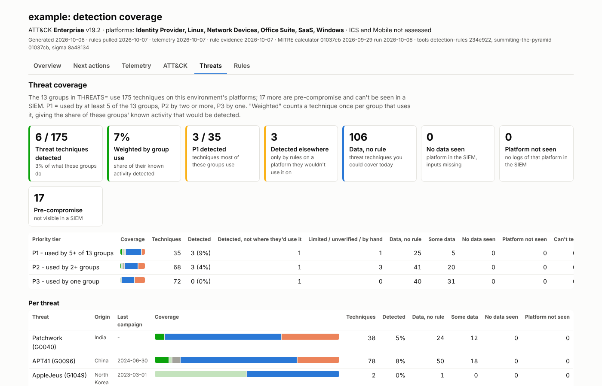

# YADDA

*Yet Another Detection Dashboard, Apparently.*

YADDA is a command-line tool for measuring MITRE ATT&CK detection coverage in Google SecOps. It reads the custom YARA-L
rules deployed in an instance, plus a few exports from the same instance, to provide give you fun insights into your 
custom rule set. It only reads from SecOps, and it can keep several environments side by side.



The question it tries to answer is whether a rule tagged with a technique covers that technique in a given
environment. A tagged rule may never fire, may watch logs from a different platform, or may depend on logs that
never arrive. YADDA checks each technique against MITRE's detection analytics (ATT&CK v18 and later) per platform,
using the log types the SIEM receives and the evidence that each rule fires.

Most of the work is done by other projects, listed under [Built on](#built-on). YADDA connects them and adds the
SecOps-specific parts.

## Try it

The repository includes a fictional environment, so you can see the output without a SecOps instance:

```
yadda setup
yadda run example
```

Then open `output/example/latest/1_example_dashboard.html`. Setting up a real environment, including a separate
Google account per environment, is covered in [docs/setup.md](docs/setup.md).

## Output

Each run writes a dated folder under `output/<environment>/`, and `latest/` holds a copy of the newest run.

| File | Contents |
|---|---|
| `1_<env>_dashboard.html` | Tabs for Overview, Next actions, Telemetry, ATT&CK, Threats and Rules |
| `2_<env>_coverage.xlsx` | The same tables as a workbook, one sheet each |
| `3_navigator_layers/` | Layers for [ATT&CK Navigator](https://mitre-attack.github.io/attack-navigator/) |
| `4_sigma_candidates/` | SigmaHQ rules converted to YARA-L for techniques with data but no rule |
| `data/` | The tables as CSV |





## Commands

```
yadda run <environment> [-step ...] [--ask]
yadda check <environment> <T-ids | group | software | --threats> [--layer]
yadda score <environment> <T-id> <-1..5> "<evidence>"
yadda test <environment> <guid | T1053.005#2> fired|missed|n/a|clear
yadda actors --sector S --country C --environment E --set|--add
yadda new <environment>
yadda import <environment> <folder | files | git URL>
yadda status
yadda setup [--latest | --check]
```

`yadda help <command>` prints examples.

`yadda run` goes through these steps: **pull** (deployed rules, through Google's
[Content Manager](https://github.com/chronicle/detection-rules/tree/main/tools/content_manager)), **queries** (the
SecOps exports, through the API), **data**, **evidence**, **robustness**, **review**, **atomics** and **sigma**. Skip a
step with `-<step>`, for example `yadda run acme -sigma -atomics`. Without API access, it uses rules loaded with
`yadda import` and query results you export by hand into the environment's `inputs/` folder.

## How a technique is judged

ATT&CK gives each technique a detection strategy with one analytic per platform, and each analytic lists the data it
needs. YADDA treats each analytic as a route to detecting the technique, and counts a route's input as present when a
log type from the same platform delivers it. Log types are mapped to platforms in `shared/log_type_platforms.csv`.
That table won't know every log type; `yadda run <environment> --ask` asks you about the unknown ones and saves the
answers for every environment.

Alert feeds from security products (CS_ALERTS, MICROSOFT_GRAPH_ALERT, GuardDuty) are reported separately as product
detections rather than as telemetry, and network sensors supply network inputs without marking a platform as seen.

Each in-scope technique gets one state:

| State | Meaning |
|---|---|
| Validated | Score 4-5: a test proved it |
| Detected | Score 3: a rule fired within EVIDENCE_DAYS and isn't noisy |
| Limited | Score 2: the rule fires but is noisy or narrow |
| Unverified | Score 1: a rule is deployed, with no evidence yet |
| Scored by hand, no rule | A score you recorded with no SIEM rule behind it; shown, not counted |
| Data, no rule | Every input of a route arrives |
| Some data | Some of a route's inputs arrive |
| No data seen | The platform's logs arrive, but none of the route's inputs |
| Platform not seen | No log type for the route's platform is in the SIEM |
| Can't tell | No telemetry export yet, or no MITRE route on these platforms |

The evidence step sets scores 1-3 from the rule health and false-positive exports, using the thresholds in
`environment.env`. Scores 4 and 5 are recorded by hand. The scale is in
[shared/score_definitions.md](shared/score_definitions.md). A rule counts only on the platforms its log types belong
to, so a rule on SaaS audit logs doesn't mark a technique as detected on Windows.

## Threats

`yadda actors --sector finance --country Germany --environment acme --set` picks ATT&CK groups known to target that
sector and country, using the [MISP galaxy](https://github.com/MISP/misp-galaxy), and saves them in the environment's
settings. The Threats tab then shows the techniques those groups use with each one's state, their software and
campaigns, published intrusions from the Attack Flow corpus as ordered steps, and techniques the Technique Inference
Engine suggests they may also use. Inferred techniques are labelled as such and not counted in coverage.



## Other steps

- **Robustness:** MITRE's Detection Coverage Calculator scores how easy each rule is to evade. YADDA translates YARA-L
  into the Sigma form the calculator reads. The calculator covers Windows Event Log and Sysmon fields only.
- **Sigma candidates:** matching SigmaHQ rules converted with pySigma-backend-secops, kept only when the environment
  sends the events they need. Review them before deploying; conversions can be wrong in ways YADDA doesn't catch.
- **Rule review:** rules that never fired, fire too often, have no ATT&CK tag or are tagged with many techniques, in
  `rule_review.csv`. Your decisions are kept between runs.
- **Validation:** Atomic Red Team tests for detected techniques, with results recorded by `yadda test`.

Scores and their history are kept in each environment's `techniques.yaml`, in
[DeTT&CT](https://github.com/rabobank-cdc/DeTTECT)'s technique-administration format.

## Limitations

- Only Google SecOps and YARA-L are supported.
- The API calls are tested against a mock built from Google's published API, not a live instance.
- The coverage view is only as good as the log type and event type mappings in `shared/`, which need extending for
  log sources they don't list yet.
- MITRE's detection analytics don't cover every technique on every platform; those show as "Can't tell".

## Folder layout

```
environments/
  _template/            copied by "yadda new"
  example/              fictional sample environment
  <name>/               one per environment (ignored by git)
    environment.env     SecOps instance, Google login, PLATFORMS=, THREATS=, thresholds
    inputs/             SecOps exports
    rules/              deployed rules
    techniques.yaml     detection scores with history
shared/                 mapping tables and the SecOps queries
output/<name>/<date>/   results
```

## Tests

```
.venv/bin/python -m pip install -r requirements-dev.txt      (Windows: .venv\Scripts\python)
.venv/bin/python -m pytest tests
```

`tests/fixtures/acme` is a small fictional environment whose rules each cover an edge case. `test_golden.py` runs the
pipeline on it and compares the output with `tests/golden/acme`. After an intended change, run
`python tests/characterize.py`, check the diff, then run it with `--update`.

## Built on

| Project | Used for |
|---|---|
| [MITRE ATT&CK](https://github.com/mitre-attack/attack-stix-data) | Techniques, detection strategies and analytics |
| [Google SecOps Content Manager](https://github.com/chronicle/detection-rules/tree/main/tools/content_manager) | Pulling deployed rules |
| [Summiting the Pyramid](https://github.com/center-for-threat-informed-defense/summiting-the-pyramid) | Detection Coverage Calculator (robustness) |
| [SigmaHQ](https://github.com/SigmaHQ/sigma) and [pySigma-backend-secops](https://github.com/AttackIQ/pySigma-backend-secops) | Rule candidates for gaps |
| [Atomic Red Team](https://github.com/redcanaryco/atomic-red-team) | Validation tests |
| [MISP galaxy](https://github.com/MISP/misp-galaxy) | Which groups target which sectors and countries |
| [Attack Flow](https://github.com/center-for-threat-informed-defense/attack-flow) | Published intrusions as ordered steps |
| [Technique Inference Engine](https://github.com/center-for-threat-informed-defense/technique-inference-engine) | Techniques a group may also use |
| [DeTT&CT](https://github.com/rabobank-cdc/DeTTECT) | The scores file format |

## License

MIT, see [LICENSE](LICENSE). The tools and data downloaded by `yadda setup` keep their own licenses. The rules in
`environments/example/rules/` come from the Google SecOps community rules and SigmaHQ and keep their original authors
and licenses; converted Sigma rules keep their author, id and path, as the Detection Rule License requires.
